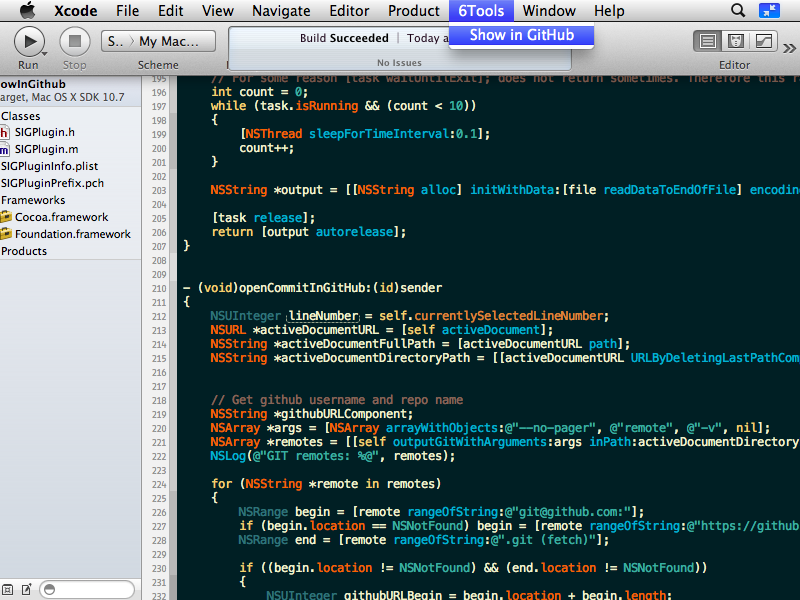

# Show in GitHub
Xcode plugin to jump to the commit on GitHub of the currently selected line in the Xcode editor window.

Show in GitHub was developed and tested with Xcode 4.2.1.

## Usage

1. [Download "Show in GitHub"](https://github.com/downloads/larsxschneider/ShowInGitHub/ShowInGitHub.zip)

2. Unzip it.

3. Move `ShowInGitHub.xcplugin` to `~/Library/Application Support/Developer/Shared/Xcode/Plug-ins/ShowInGitHub.xcplugin

3. Restart Xcode

4. Click on any line in a GitHub project and choose "6Tools" --> "Show in GitHub" in the main menu

## Contact

Lars Schneider <larsxschneider+sig@gmail.com>

## License

Xcode Scripting Interface is available under the BSD license. See the LICENSE file for more info.
