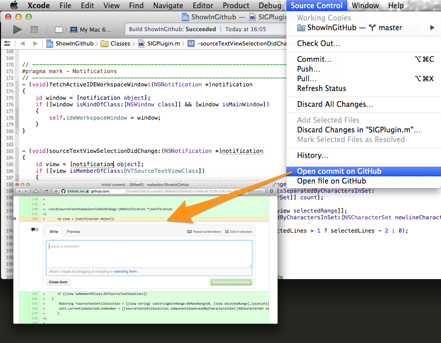

# Show in GitHub / BitBucket
Xcode plugin to open a related Github or BitBucket page directly from the Xcode editor code window. Installs easily through the Xcode package manager [Alcatraz](http://alcatraz.io/).

*Show in GitHub* has been tested with Xcode 5.1.1.

## Usage

Click on any line in a GitHub project and choose "Source Control" (**GitHub** for Xcode <5.0) --> **Open commit on GitHub** in the main menu. (e.g. to send this URL via IM)

**Open file on Github** simply opens the file at its current branch, and not the last commit which changed it. Alternatively you can select a range lines of code and follow the same steps.

[Youtube Tutorial (made under Xcode 4.x)](https://www.youtube.com/watch?v=dWRjkYk8A6s)

## Installation

0. Install it via [Alcatraz](http://alcatraz.io/)

or

1. [Clone](github-mac://openRepo/https://github.com/larsxschneider/ShowInGitHub) the repo on your local machine.

2. Build it in Xcode.

3. `ShowInGitHub.xcplugin` should appear in `~/Library/Application Support/Developer/Shared/Xcode/Plug-ins`.

3. Restart Xcode.

## Contact

Lars Schneider <larsxschneider+sig@gmail.com>

## License

ShowInGitHub is available under the BSD license. See the LICENSE file for more info.
